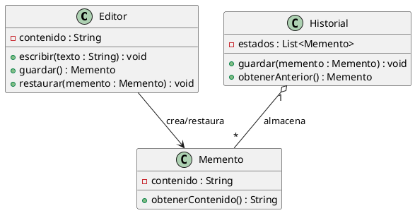

# IngSoft-Patrones

# Patrón Memento

## Contexto

Este patrón sirve para guardar el estado interno de un objeto y poder restaurarlo posteriormente, sin mostrar los detalles de cómo está compuesto internamente.

Puede servir, por ejemplo, para implementar un sistema de deshacer, guardar una partida o recuperar una configuración anterior.

## Problema

Cuando tenemos un objeto cuyo estado va cambiando, puede ser necesario guardar estados anteriores para poder recuperarlos más adelante.

El problema está en hacer esto sin que otros objetos tengan que acceder directamente al estado interno del objeto.

## Solución

Memento consiste en crear un objeto separado que guarda una copia del estado del objeto original.

El objeto original, llamado `Originator`, es el encargado de crear el `Memento` con su estado actual y también de utilizarlo posteriormente para restaurarse.

Por otro lado, tenemos el `Caretaker`, que se encarga de guardar los diferentes Mementos sin necesidad de conocer cómo está compuesto internamente el `Originator`.

## Implementación

En nuestro ejemplo tenemos tres clases:

* **`Editor`**: es el `Originator`, contiene el estado que puede ir cambiando.
* **`Memento`**: guarda el estado del `Editor` en un momento determinado.
* **`Historial`**: es el `Caretaker`, guarda una colección de Mementos para poder recuperar estados anteriores.

Cuando el `Editor` guarda su estado, crea un `Memento`. El `Historial` lo almacena y, cuando necesitamos volver a un estado anterior, se lo devuelve al `Editor` para que pueda restaurarlo.

## UML

## Ejemplo

Utilizamos un editor de texto.

Primero, el `Editor` tiene el contenido `"Hola"` y guarda ese estado en un `Memento`. Después cambia su contenido a `"Hola mundo"` y vuelve a guardar el estado.

Si posteriormente cambia a `"Hola mundo!!!"` y queremos deshacer el último cambio, el `Historial` devuelve el Memento anterior y el `Editor` restaura el contenido que tenía guardado.

De esta forma podemos volver a un estado anterior sin tener que acceder directamente a la estructura interna del `Editor`.

## Consecuencias

### Ventajas

* Permite guardar y restaurar estados anteriores.
* Mantiene ocultos los detalles internos del objeto.
* El `Caretaker` puede guardar varios estados sin conocer su funcionamiento interno.
* Puede utilizarse para implementar funcionalidades como deshacer.

### Desventajas

* Guardar muchos estados puede consumir bastante memoria.
* Si el objeto tiene un estado muy grande, los Mementos también pueden ocupar bastante espacio.

## Cuándo utilizarlo

Se puede utilizar cuando necesitamos guardar y restaurar estados anteriores de un objeto sin exponer su estructura interna.

Algunos ejemplos son sistemas de deshacer, partidas guardadas o recuperación de configuraciones anteriores.

## Conclusión

Memento permite guardar diferentes estados de un objeto y recuperarlos posteriormente, manteniendo ocultos sus detalles internos.

En nuestro ejemplo, el `Editor` es el `Originator`, el `Memento` guarda los estados y el `Historial` actúa como `Caretaker`, conservando los diferentes estados para poder restaurarlos cuando sea necesario.
