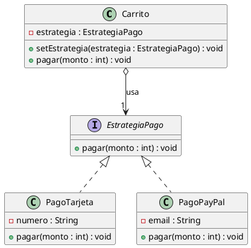

# IngSoft-Patrones

# Patrón Strategy

## Contexto

Este patrón sirve para definir una familia de algoritmos o comportamientos similares, encapsular cada uno en una clase separada y permitir intercambiarlos en tiempo de ejecución.

Un caso común es un sistema de cobro, donde el usuario puede elegir pagar con diferentes métodos (tarjeta, PayPal, efectivo, etc.).

## Problema

Si implementamos todos los métodos de pago dentro de una misma clase, solemos usar condicionales (`if-else` o `switch`):

```java
if (tipo.equals("TARJETA")) {
    // cobrar con tarjeta
} else if (tipo.equals("PAYPAL")) {
    // cobrar con paypal
}
```

Esto genera varios problemas:
* Cada vez que se agrega un nuevo método de pago, hay que modificar la clase existente (viola el principio Abierto/Cerrado).
* La clase acumula responsabilidades que no le corresponden.
* El código se vuelve difícil de leer y mantener.

## Solución

Strategy propone extraer cada forma de realizar la tarea a una clase separada:

* Definir una interfaz común (**Estrategia**) con el método que ejecutarán todos los algoritmos.
* Crear clases concretas (**Estrategias Concretas**) que implementan esa interfaz.
* La clase principal (**Contexto**) solo guarda una referencia a la interfaz y delega la ejecución de la acción.

De esta forma, el contexto no necesita saber cómo funciona cada algoritmo por dentro y podemos cambiar de estrategia en cualquier momento.

## Implementación

En nuestro ejemplo tenemos:

* **`EstrategiaPago`**: interfaz que define el método `pagar(int monto)`.
* **`PagoTarjeta`**: estrategia concreta que cobra usando un número de tarjeta.
* **`PagoPayPal`**: estrategia concreta que cobra usando un correo electrónico.
* **`Carrito`**: es el contexto, guarda la estrategia actual y delega el cobro mediante su método `pagar(int monto)`.
* **`Main`**: clase de prueba donde creamos el carrito, asignamos una estrategia y la cambiamos en tiempo de ejecución.

## UML



## Ejemplo

En `Main`:

1. Creamos un `Carrito`.
2. Le asignamos la estrategia `PagoTarjeta` y llamamos a `carrito.pagar(1000)`.
3. Luego, cambiamos la estrategia con `carrito.setEstrategia(new PagoPayPal(...))` y volvemos a llamar a `carrito.pagar(500)`.

El carrito realiza el cobro sin necesidad de conocer los detalles internos de cada medio de pago ni usar condicionales.

## Consecuencias

### Ventajas

* Permite cambiar de algoritmo en tiempo de ejecución.
* Fácil de extender: para agregar un nuevo método de pago solo creamos una nueva clase que implemente `EstrategiaPago` sin tocar el `Carrito`.
* Elimina estructuras condicionales complejas.
* Cada algoritmo está aislado y es fácil de probar.

### Desventajas

* Aumenta la cantidad de clases en el proyecto.
* El cliente debe conocer las diferentes estrategias para elegir cuál utilizar.

## Cuándo utilizarlo

* Cuando tenemos distintas variantes de un mismo algoritmo y queremos intercambiarlas dinámicamente.
* Cuando una clase tiene muchos condicionales para elegir entre diferentes comportamientos.
* Cuando queremos aislar la lógica y datos propios de un algoritmo del resto del sistema.

## Conclusión

El patrón Strategy permite separar los algoritmos de la clase que los utiliza, delegando la tarea en objetos intercambiables. 

En nuestro ejemplo, `Carrito` delega el cobro a `EstrategiaPago`, lo que permite pagar con `PagoTarjeta` o `PagoPayPal` de manera flexible, limpia y extensible.
